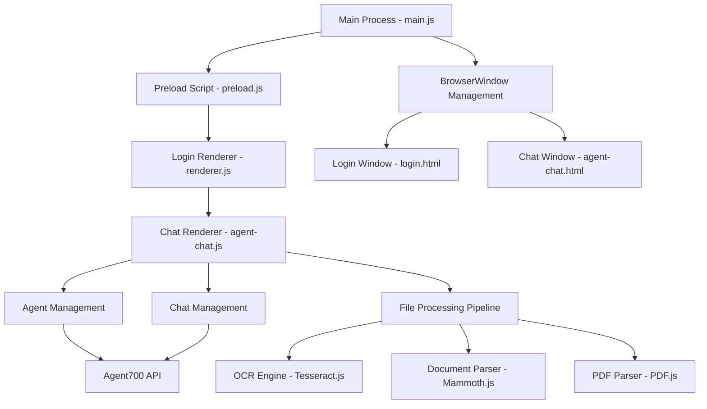
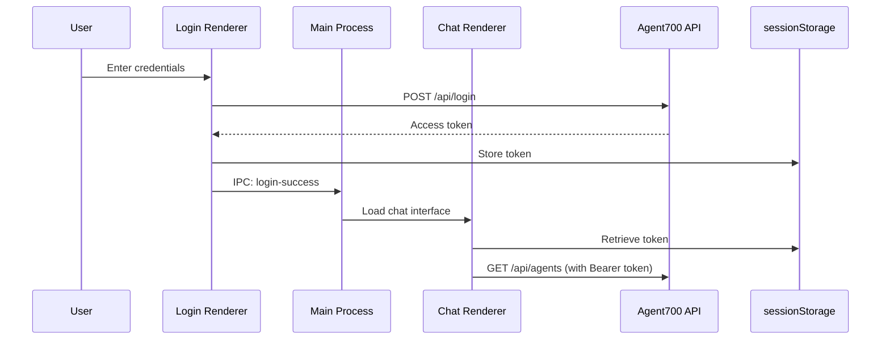
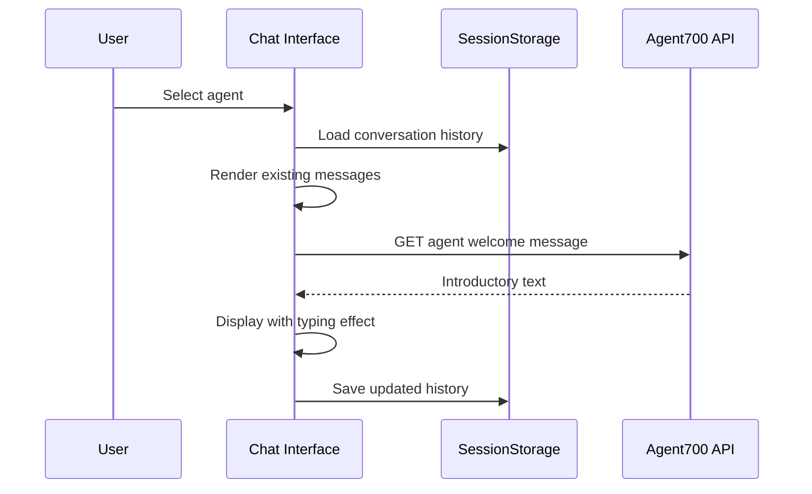
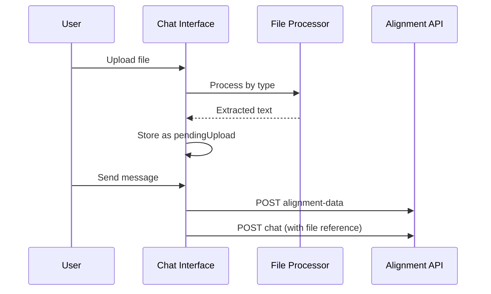
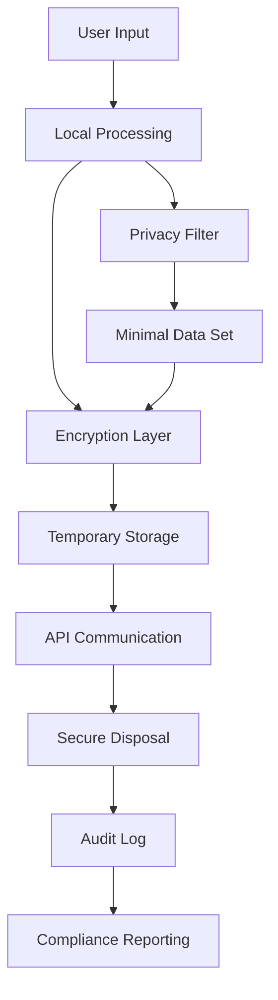
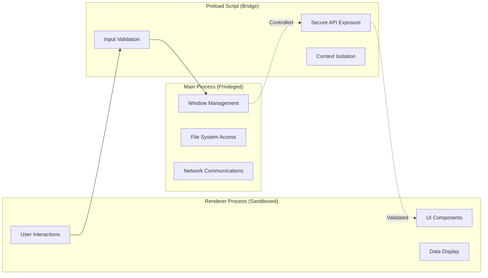

# System Patterns & Architecture

## Security-First Architecture Overview

The Agent700 Desktop App follows a **zero-trust, security-first** Electron architecture with strict separation between main and renderer processes, enhanced with custom patterns for secure AI chat management, encrypted file processing, and privacy-by-design data handling.



## Key Design Patterns

### 1. Multi-Window Navigation Pattern
**Pattern**: Single main process manages window transitions based on authentication state
```javascript
// Main Process (main.js)
app.whenReady() → Load login.html
ipcMain.on('login-success') → Load agent-chat.html
```

**Benefits**:
- Clear separation of authentication and chat concerns
- Memory efficiency (single window at a time)
- Simple state management

### 2. Class-Based Component Architecture
**Pattern**: Each major feature implemented as ES6 class with clear responsibilities

```javascript
// Core Classes Structure
class getAgents {
    // Handles initial agent fetching and UI setup
    constructor() → fetch agents → initialize selectAgent
}

class selectAgent {
    // Manages all chat functionality
    // - Agent selection and switching
    // - Message handling and display
    // - File processing coordination
    // - Conversation persistence
}
```

**Benefits**:
- Encapsulated functionality
- Clear data flow and dependencies
- Easier testing and maintenance

### 3. Session Storage Pattern
**Pattern**: Persistent conversation management using sessionStorage with agent-specific keys

```javascript
// Storage Key Pattern
sessionStorage.setItem(`chatHistory_${agentId}`, JSON.stringify(history))
sessionStorage.getItem(`chatHistory_${agentId}`)
sessionStorage.removeItem(`chatHistory_${agentId}`)
```

**Benefits**:
- Per-agent conversation isolation
- Automatic cleanup on app restart
- Simple serialization/deserialization

### 4. File Processing Pipeline Pattern
**Pattern**: Unified async file processing with type detection and appropriate handlers

```javascript
// File Processing Flow
uploadFile() → 
    File Selection → 
    Type Detection → 
    Handler Selection (text/docx/pdf/image) → 
    Extraction → 
    pendingUpload storage → 
    API alignment-data submission
```

**File Type Handlers**:
- **Text files**: Direct text reading
- **DOCX files**: Mammoth.js raw text extraction
- **PDF files**: PDF.js page-by-page text extraction
- **Images**: Tesseract.js OCR with custom worker/core paths

### 5. Progressive Message Rendering Pattern
**Pattern**: Two-mode message display system for different user experience needs

```javascript
// Instant Rendering (history loading)
renderBotMarkdown(content) → immediate HTML injection

// Typing Effect (new messages)
displayBotResponseTypingEffect(content) → 
    marked.parse() → 
    DOMPurify.sanitize() → 
    character-by-character animation
```

## Component Relationships

### Authentication Flow


### Agent Selection & Chat Flow


### File Upload & Processing Flow


## Critical Implementation Paths

### 1. Security Context Bridge
**Path**: main.js → preload.js → renderer contexts
```javascript
// preload.js - Secure API exposure
contextBridge.exposeInMainWorld('electronAPI', {
    sendLoginSuccess: () => ipcRenderer.send('login-success'),
    workerPath: pathToFileURL(...),  // Tesseract worker
    corePath: pathToFileURL(...)     // Tesseract core
});

contextBridge.exposeInMainWorld('env', {
    API_URL: process.env.API_URL
});
```

### 2. Token Management Path
**Path**: Login → SessionStorage → API Headers
```javascript
// Login success → token storage → API usage
sessionStorage.setItem('accessToken', token)
headers: { "Authorization": `Bearer ${token}` }
```

### 3. Message Processing Path
**Path**: User Input → History → API → Response → Display → Storage
```javascript
handleSendMessage() →
    conversationHistory.push(userMessage) →
    postRequest() →
    conversationHistory.push(apiResponse) →
    displayBotResponseTypingEffect() →
    saveConversationHistory()
```

### 4. File Processing Path
**Path**: File Selection → Type Detection → Processing → API Upload → Integration
```javascript
uploadFile() →
    file type detection →
    appropriate processor (OCR/PDF/DOCX/text) →
    pendingUpload storage →
    sendToAPI(alignment-data) →
    chat message integration
```

## Error Handling Patterns

### API Error Handling
```javascript
// Consistent error handling across API calls
fetch(url, options)
    .then(response => {
        if (!response.ok) {
            throw new Error(`HTTP error! Status: ${response.status}`);
        }
        return response.json();
    })
    .catch(error => console.error('Error:', error));
```

### File Processing Error Handling
```javascript
// Graceful degradation for unsupported files
if (fileType === 'supportedType') {
    // Process file
} else {
    alert('Unsupported file type');
    return;
}
```

## Performance Optimization Patterns

### 1. Lazy Loading
- Agents loaded only after authentication
- Chat history loaded only when agent selected
- File processing triggered only on upload

### 2. Memory Management
- Single BrowserWindow instance
- Conversation histories stored in sessionStorage (cleared on restart)
- File processing with immediate cleanup after extraction

### 3. UI Responsiveness
- Typing effects with configurable speed (20ms per character)
- Immediate UI feedback for user actions
- Async file processing with progress indication

## Security & Privacy Design Patterns

### 1. Zero-Trust Security Pattern
**Pattern**: Assume no component is inherently trusted; verify everything
```javascript
// Token Validation Pattern
const validateToken = (token) => {
    if (!token || isTokenExpired(token) || !isTokenValid(token)) {
        redirectToLogin();
        return false;
    }
    return true;
};

// Input Sanitization Pattern
const sanitizeInput = (input) => {
    return DOMPurify.sanitize(marked.parse(input));
};
```

### 2. Data Minimization Pattern
**Pattern**: Collect and process only necessary data
```javascript
// Minimal Data Collection
const extractRequiredData = (fileContent) => {
    // Process only text content, discard metadata
    return {
        content: sanitizeText(fileContent),
        timestamp: Date.now()
        // No file paths, user info, or system data
    };
};
```

### 3. Secure Disposal Pattern
**Pattern**: Securely dispose of sensitive data after use
```javascript
// Secure Memory Cleanup
const secureDisposal = (sensitiveData) => {
    // Overwrite memory
    if (typeof sensitiveData === 'string') {
        sensitiveData = '0'.repeat(sensitiveData.length);
    }
    sensitiveData = null;
    // Force garbage collection
    if (global.gc) global.gc();
};
```

### 4. Encryption-at-Rest Pattern
**Pattern**: Encrypt sensitive data in local storage
```javascript
// Encrypted Storage Pattern
const encryptedStorage = {
    set: (key, data) => {
        const encrypted = encrypt(JSON.stringify(data));
        sessionStorage.setItem(key, encrypted);
    },
    get: (key) => {
        const encrypted = sessionStorage.getItem(key);
        return encrypted ? JSON.parse(decrypt(encrypted)) : null;
    }
};
```

### 5. Audit Trail Pattern
**Pattern**: Log security-relevant events for compliance
```javascript
// Security Event Logging
const auditLog = {
    logSecurityEvent: (event, details) => {
        const auditEntry = {
            timestamp: new Date().toISOString(),
            event: event,
            details: sanitizeForLog(details),
            sessionId: getCurrentSessionId()
        };
        appendToSecureLog(auditEntry);
    }
};
```

## Privacy-by-Design Architecture

### Data Flow Isolation


### Security Boundaries


## State Management Patterns

### Application State (Security Enhanced)
- **Authentication**: Encrypted sessionStorage with automatic expiration
- **Agent Selection**: DOM classes with security status indicators
- **Conversations**: Encrypted per-agent storage with audit trails
- **File Uploads**: Secure temporary object with automatic disposal

### Security State
- **Session Security**: Token validation, expiration tracking, refresh handling
- **Privacy Mode**: User consent status, data retention preferences
- **Audit State**: Security event logging, compliance status tracking
- **Threat Detection**: Anomaly detection, security alerts, response actions

### UI State (Privacy Aware)
- **Active Agent**: DOM class manipulation with security indicators
- **Input State**: Button enable/disable with security validation
- **Upload State**: Security scanning status and privacy notices
- **Message Display**: Sanitized content with security metadata
